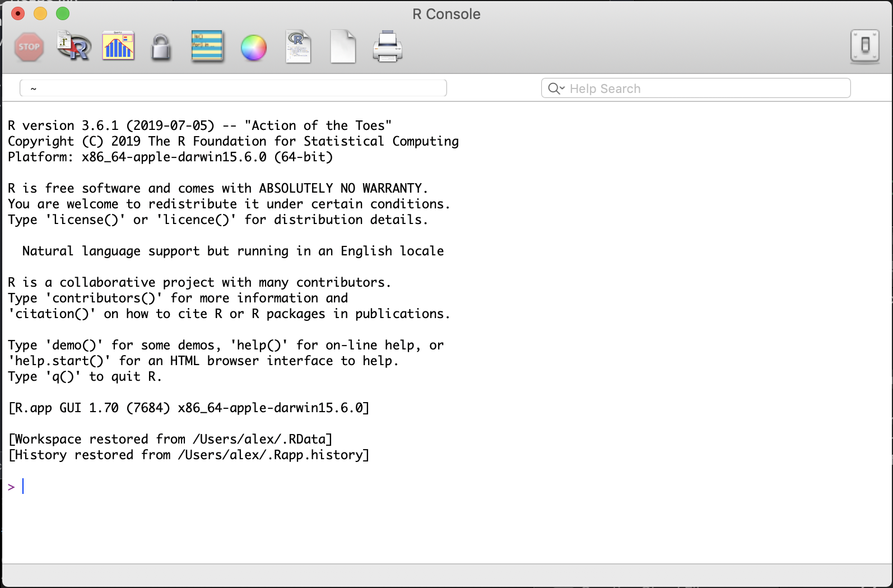
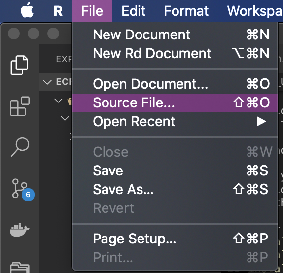
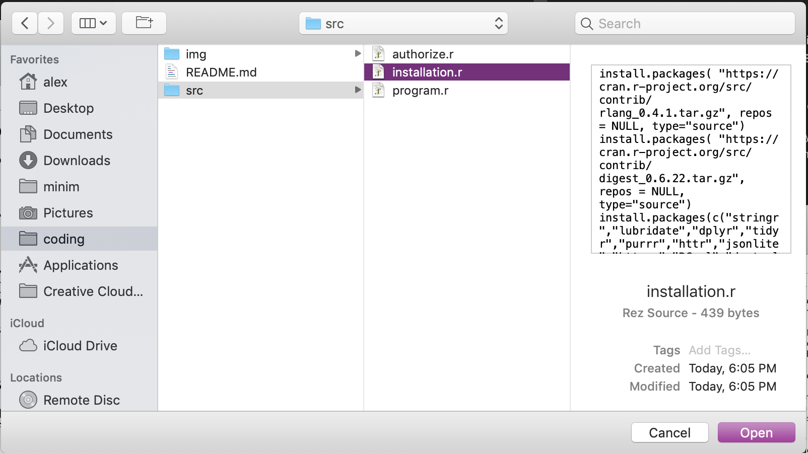
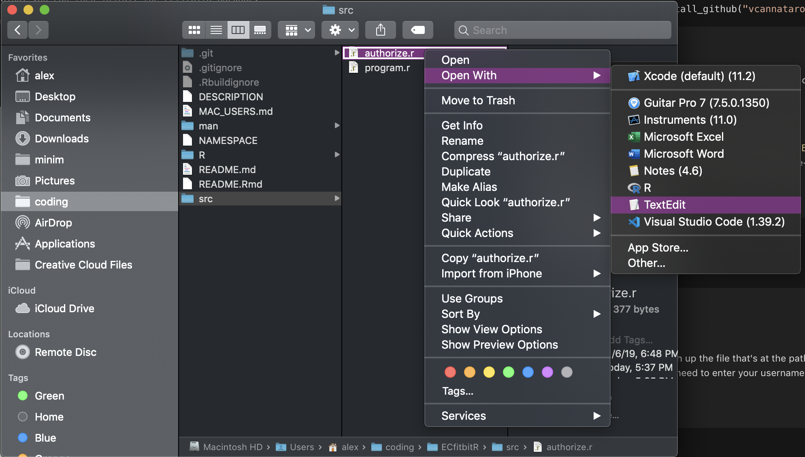
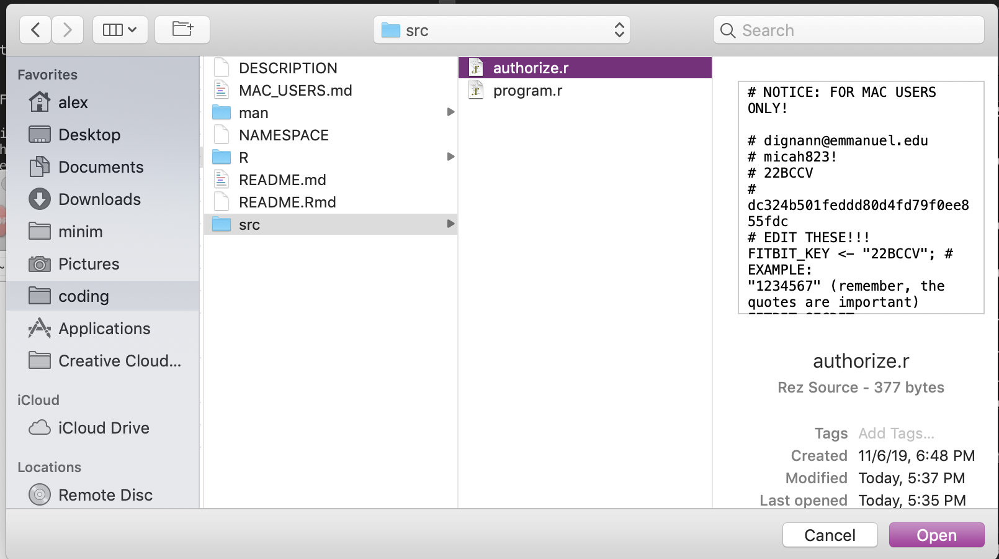

# EC Fitbit R

For Mac users ONLY, I've made a much simpler way to gather your data.

## Getting started

**To avoid potential issues, it's important to leave the SAME window of R Console open the entire time.** I explain what R console is below..

Download the project from github by clicking `Clone or Download` and then `Download ZIP`. **MAKE SURE TO SAVE THIS DIRECTLY TO YOUR DESKTOP**.
Once the zip has downloaded, double click on the .zip file to extract it.

You now need to download R. Follow the instructions in the `README.md` file to do this.

When you open up R for the first time, you will be brought to what's called the "R Console", which is somewhere that you can run R commands.

The R console looks like this:




## Using the program

### Installation

Open up the R console if it isn't still open. Click `File -> Source File` and open up the file that's at the path `THIS_FOLDER/src/installation.r`



Which file to open..



- If prompted for a mirror (where the download will come from), click the top entry called `0 - Cloud` or whatever is closest to your location
- If prompted with a message about “Do you want to install from sources the package which needs compilation? (Yes/no/cancel)” type Yes and hit enter.

### Before getting started...

First, you'll need to authorize the fitbit app using the instructions [here](https://github.com/vcannataro/ECfitbitR#creating-a-fitbit-web-app).

You'll need to edit the file called `authorize.r` and replace the placeholder text with your personal `CLIENT_ID` and `CLIENT_SECRET`.
I'm not sure if double clicking the file to edit it will work - you can use a programcalled `textedit` that comes pre-installed on macOSX to edit the file.

Make sure the they're wrapped in quotes still, like this:
```r
FITBIT_KEY <- "54FFGRS";
FITBIT_SECRET <- "456ert4yh6esefg6546854ur65t4";

token <- fitbitr::oauth_token();
```




### Authorization

Open up the R console if it isn't still open. Click `File -> Source File` and open up the file that's at the path `THIS_FOLDER/src/authorize.r`.
A web browser will open up, and you need to enter your username and password to let the app work.

How you should click "Source File..."


Which file to open..



If this was successful, you should see something like this in the R console:
```
> source("/Users/alex/coding/ECfitbitR/src/authorize.r")
Waiting for authentication in browser...
Press Esc/Ctrl + C to abort
Authentication complete.
> 
```

### Download your data

Repeat the same step as before, except this time you'll want to open the file named `program.r`.

Open up the R console if it isn't still open. Click `File -> Source File` and open up the file that's at the path `THIS_FOLDER/src/program.r`.
This will take a little bit to complete, but afterwards your data will be downloaded and saved to your desktop.

If you look at your desktop, you'll notice a new file and a new folder. One called `my_fitbit_data.RData` and a folder with a bunch of `.csv` files named `my_fitbit_data`.

If this was successful, you should see something like this in the R console:
```
> source("/Users/alex/coding/ECfitbitR/src/program.r")
Getting my data...
Collecting activity data...
Collecting activity data...
Finished date: 2019-10-01... 30 dates left.
Finished date: 2019-10-02... 29 dates left.
Finished date: 2019-10-03... 28 dates left.
Finished date: 2019-10-04... 27 dates left.
Finished date: 2019-10-05... 26 dates left.
Finished date: 2019-10-06... 25 dates left.
Finished date: 2019-10-07... 24 dates left.
Finished date: 2019-10-08... 23 dates left.
Finished date: 2019-10-09... 22 dates left.
Finished date: 2019-10-10... 21 dates left.
Finished date: 2019-10-11... 20 dates left.
Finished date: 2019-10-12... 19 dates left.
Finished date: 2019-10-13... 18 dates left.
Finished date: 2019-10-14... 17 dates left.
Finished date: 2019-10-15... 16 dates left.
Finished date: 2019-10-16... 15 dates left.
Finished date: 2019-10-17... 14 dates left.
Finished date: 2019-10-18... 13 dates left.
Finished date: 2019-10-19... 12 dates left.
Finished date: 2019-10-20... 11 dates left.
Finished date: 2019-10-21... 10 dates left.
Finished date: 2019-10-22... 9 dates left.
Finished date: 2019-10-23... 8 dates left.
Finished date: 2019-10-24... 7 dates left.
Finished date: 2019-10-25... 6 dates left.
Finished date: 2019-10-26... 5 dates left.
Finished date: 2019-10-27... 4 dates left.
Finished date: 2019-10-28... 3 dates left.
Finished date: 2019-10-29... 2 dates left.
Finished date: 2019-10-30... 1 dates left.
Finished date: 2019-10-31... 0 dates left.
Collecting heart rate data...
Finished date: 2019-10-01... 30 dates left.
Finished date: 2019-10-02... 29 dates left.
Finished date: 2019-10-03... 28 dates left.
Finished date: 2019-10-04... 27 dates left.
Finished date: 2019-10-05... 26 dates left.
Finished date: 2019-10-06... 25 dates left.
Finished date: 2019-10-07... 24 dates left.
Finished date: 2019-10-08... 23 dates left.
Finished date: 2019-10-09... 22 dates left.
Finished date: 2019-10-10... 21 dates left.
Finished date: 2019-10-11... 20 dates left.
Finished date: 2019-10-12... 19 dates left.
Finished date: 2019-10-13... 18 dates left.
Finished date: 2019-10-14... 17 dates left.
Finished date: 2019-10-15... 16 dates left.
Finished date: 2019-10-16... 15 dates left.
Finished date: 2019-10-17... 14 dates left.
Finished date: 2019-10-18... 13 dates left.
Finished date: 2019-10-19... 12 dates left.
Finished date: 2019-10-20... 11 dates left.
Finished date: 2019-10-21... 10 dates left.
Finished date: 2019-10-22... 9 dates left.
Finished date: 2019-10-23... 8 dates left.
Finished date: 2019-10-24... 7 dates left.
Finished date: 2019-10-25... 6 dates left.
Finished date: 2019-10-26... 5 dates left.
Finished date: 2019-10-27... 4 dates left.
Finished date: 2019-10-28... 3 dates left.
Finished date: 2019-10-29... 2 dates left.
Finished date: 2019-10-30... 1 dates left.
Finished date: 2019-10-31... 0 dates left.
Collecting sleep data...
All data collected!
File saved to: ~/Desktop/my_fitbit_data.RData
Warning messages:
1: replacing previous import ‘dplyr::intersect’ by ‘lubridate::intersect’ when loading ‘ECfitbitR’ 
2: replacing previous import ‘dplyr::union’ by ‘lubridate::union’ when loading ‘ECfitbitR’ 
3: replacing previous import ‘dplyr::setdiff’ by ‘lubridate::setdiff’ when loading ‘ECfitbitR’ 
4: replacing previous import ‘magrittr::extract’ by ‘tidyr::extract’ when loading ‘ECfitbitR’ 
```

I'm not too sure about those warnings LOL but the end result will be your data saved in a nice clean format.
